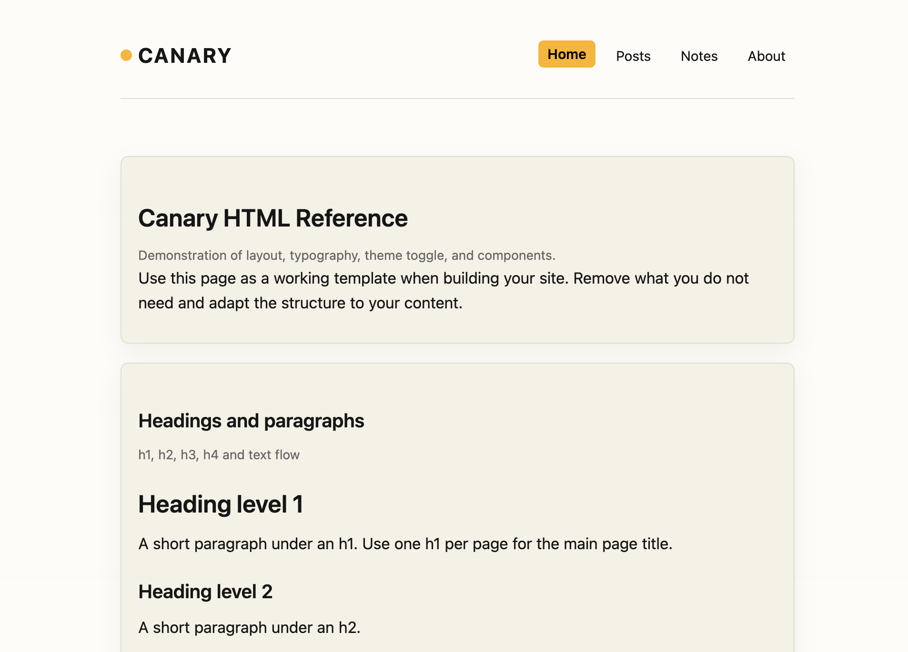

# Canary

Ultra-minimal, fast, accessible HTML theme.

## Features

- **Semantic HTML5** — Proper landmarks and structure for screen readers
- **Accessible** — WCAG 2.1 AA compliant, keyboard navigation, focus states
- **Fast** — ~5 KB of minified CSS, system fonts, no dependencies
- **Responsive** — Mobile-first, flexible layout, auto dark/light modes
- **Reference pages** — Examples of headings, lists, blockquotes, code, images

## Getting Started

1. Download or clone this repository
2. Replace `index.html` content with your own
3. Customise colours in `style.css` via CSS custom properties
4. Add your content to `posts/`, `notes/`, and `about/` pages

## Licence

MIT Licence — see `LICENCE` for details

## Credits

Created by [Doug Belshaw](https://dougbelshaw.com)

Image credit: Canary photo by César Ardila on [Unsplash](https://unsplash.com)
